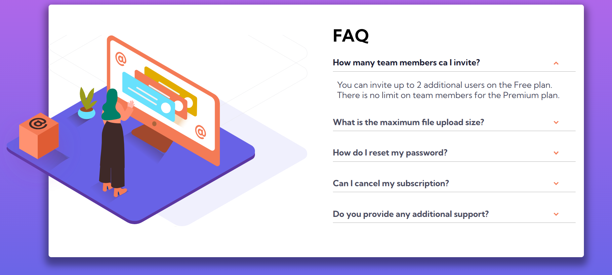
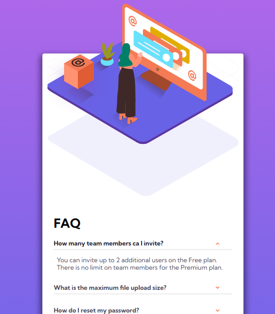

# Frontend Mentor - Interactive rating component solution

This is a solution to the [Interactive rating component challenge on Frontend Mentor](https://www.frontendmentor.io/challenges/interactive-rating-component-koxpeBUmI). Frontend Mentor challenges help you improve your coding skills by building realistic projects.

## Table of contents

- [Overview](#overview)
  - [The challenge](#the-challenge)
  - [Screenshot](#screenshot)
  - [Links](#links)
- [My process](#my-process)
  - [Built with](#built-with)
  - [What I learned](#what-i-learned)
  - [Continued development](#continued-development)
  - [Useful resources](#useful-resources)
- [Author](#author)
- [Acknowledgments](#acknowledgments)

## Overview

### The challenge

Users should be able to:

- View the optimal layout for the app depending on their device's screen size
- See hover states for all interactive elements on the page
- Select and submit a number rating
- See the "Thank you" card state after submitting a rating

### Screenshot

The following screenshots shows both the mobile and desktop version of the project.




### Links

- Solution URL: [Source code](https://github.com/Rickyngechu/accordion)
- Live Site URL: [Netlify live web](https://frontendmentour-5.netlify.app)

## My process

### Built with

- Semantic HTML5 markup
- CSS custom properties
- Flexbox
- Responsive web design.
- Mobile-first workflow

### What I learned

I learned about buliding accordion sections with javascript.

```js
el.forEach((el) =>
  el.addEventListener("click", function (e) {
    e.target.classList.toggle("add");
  })
);
```

### Continued development

I will continue perfecting my css and html skills moreso creating custom buttons,checkboxes and being able to manipulate them.However since the challenge had an added advantage of one being able to accomplish the task without using js,that is the next challenge.

### Useful resources

- [Tools](Jonas.io/resources) - This helped me for color and web testing tools. I really liked this pattern and will use it going forward.

- [Tools](https://developer.mozilla.org/en-US/docs/Web/API) - This is mozzila developer network for web developer documentation of html css and js.

-[Tools](https://www.youtube.com/watch?v=dPLHi7tsoFU)-This is a great front end website for learning how to develop websites.

## Author

- Website - [Erick Ngechu](https://rickyportf.netlify.app)
- Frontend Mentor - [@Rickyngechu](https://www.frontendmentor.io/profile/Rickyngechu)
- Twitter - [@Ricky_101com](https://twitter.com/@Ricky_101com)

## Acknowledgments

I would like to acknowlegde Jonas schmedtman for the great skills he has offered me in his javascript courses.Furthermore I would like to pass my gratitude towards Kevin powell a great css master who has sharpened my css skills and responsive web design in general.

Some youtube tutorials on accordion.
